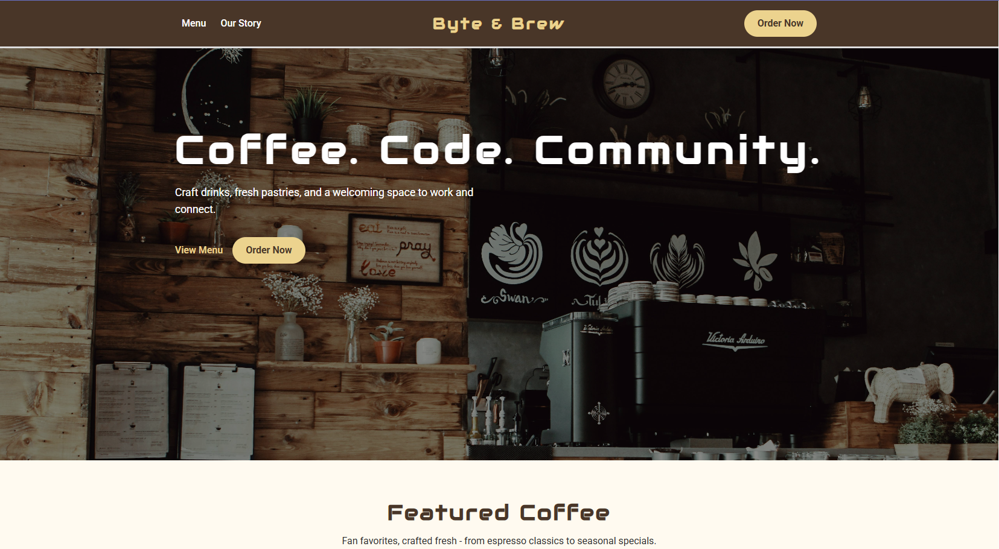

# Byte & Brew – Coffee Shop Landing Page

🔗 **Live Demo:** https://codebreaker8609.github.io/byte-and-brew-landing-page/

A responsive, accessible landing page for a modern coffee shop brand.  
Built to showcase semantic HTML, modern CSS layout techniques, and UI polish.

---

## ✨ Features

- Responsive navigation with centered text logo and call-to-action  
- Hero section with overlayed text  
- Product cards with consistent alignment  
- Customer reviews section  
- Accessible footer with SVG social icons  
- Mobile-first layout using CSS Grid and Flexbox  

---

## 🛠️ Tech Stack

- **HTML5** (semantic markup)  
- **CSS3** (Grid, Flexbox, custom properties)  
- **Google Fonts** (Audiowide, Roboto)  
- **SVG icons**

---

## ♿ Accessibility

- ARIA labels for interactive elements  
- Visible keyboard focus states  
- Semantic landmarks (`header`, `nav`, `main`, `section`, `footer`)  

---

## 🔍 Performance & SEO

- Lazy-loaded images (`loading="lazy"`)  
- Meta description and Open Graph tags  
- Clean heading hierarchy for SEO  

---

## 🖼️ Screenshots

### Desktop View

### Mobile View

---

## 🚧 Future Improvements

- Convert hero background to `` for improved LCP  
- Run Lighthouse optimization pass  
- Add JavaScript-powered mobile menu or ordering modal  

---

## 📚 What I Learned

- Building responsive layouts with CSS Grid and Flexbox  
- Writing accessible, semantic HTML  
- Structuring UI sections for clarity and usability  

---

Built as part of a front-end portfolio project.
